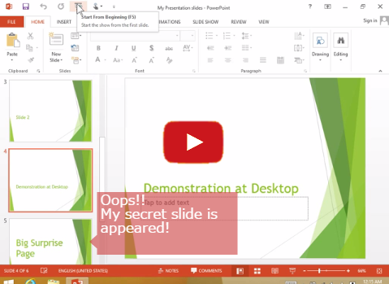

# Switch to Demo for Presentation

## Summary / 概要

This application allows you to hide or show the slideshow window of PowerPoint when you type Win-key + Shift + H, and it stays on task tray.

It's convenient to switch presentation to demo.

Win キー + Shift + H を押すと、PowerPoint のスライドショー画面の非表示/表示を切り替える、タスクトレイに常駐するアプリケーションです。

プレゼンの途中でデモに切り替えたいときに便利です。

## Usage (movie) / 使い方 (動画)

## Publishing Point / 配布場所

### ClickOnce Edition / ClickOnce 版

[http://clickonceget.azurewebsites.net/app/SwitchToDemoBootstrap](http://clickonceget.azurewebsites.net/app/SwitchToDemoBootstrap)

I recommend use Internet Explorer to open above URL.  
インターネットエクスプローラーを使って上記URLを開くことをお勧めします。

If you use another web browsers, you will get downloading `.application` file. After downloading, please open the `.application` file manually. Then start installation and launching.  
IE以外のブラウザをお使いの場合は、`.application` ファイルのダウンロードが始まります。ダウンロードが終わったら、手動で `.application` ファイルを開いてください。するとインストールと実行が始まります。

You will encounter security warning uring installation. Please open the [More info] link and click [Run Anyway] button.  
インストール中、セキュリティ警告が表示されます。[詳細] リンクを開き、[実行] ボタンをクリックしてください。

### Zip archived Edition / Zip 圧縮版

[https://github.com/jsakamoto/Switch-to-Demo-for-Presentation/releases/tag/ver.1.4.1](https://github.com/jsakamoto/Switch-to-Demo-for-Presentation/releases/tag/ver.1.4.1)

## Features

- Very easy to from download and install to launch the app powered by **ClickOnce** Technology.
 - If you chose [Zip archived edition](https://github.com/jsakamoto/Switch-to-Demo-for-Presentation/releases/tag/ver.1.4.1), You only download and execute a single .exe file to use. You don't need any runtime library. ex) .NET Framework, and etc.
- Support for Microsoft PowerPoint 2007, 2010, and 2013 (include viewer).
 - at Windows 7 and Windows 8.
- Implemented by C++ & Win32 SDK. (exclude ClickOnce boot strapper.)
 - Minimal footprint.

## 特徴

- **ClickOnce** テクノロジにより、ダウンロードからインストール、実行まで、手間なし一直線。
 - [Zip圧縮版](https://github.com/jsakamoto/Switch-to-Demo-for-Presentation/releases/tag/ver.1.4.1)ならダウンロードして解凍後、.exe 一本、実行するだけ。.NET Framework 等、ランタイム不要。

- 現時点で Microsoft PowerPoint の 2007、2010、2013 (含む Viewer) に対応。
  - Windows 8 Pro (x64) で動作確認。
- C++ & Win32 SDK だけで記述。(ClickOnce のブートストラップは除く)
 - 最小のフットプリント。
